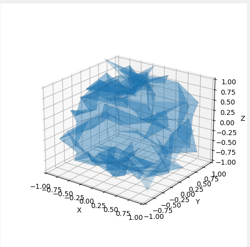

# landscape-generation

Python application using the Tkinter library. Contains 3 methods of landscape generation: for regular grid, irregular
grid and spherical landscape by reducing and increasing hemispheres

# Examples

### Regular height grid landscape

### Irregular height grid landscape

### Spherical landscape

### Spherical landscape with polygons
